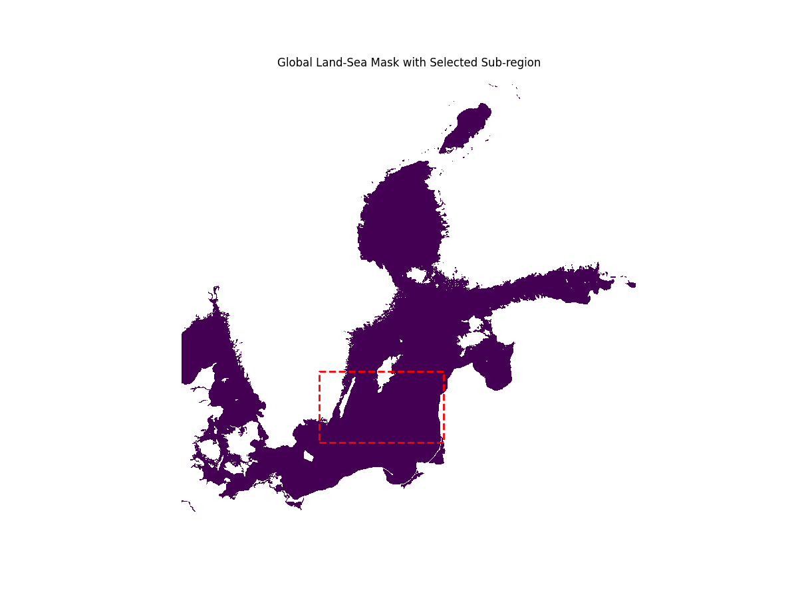
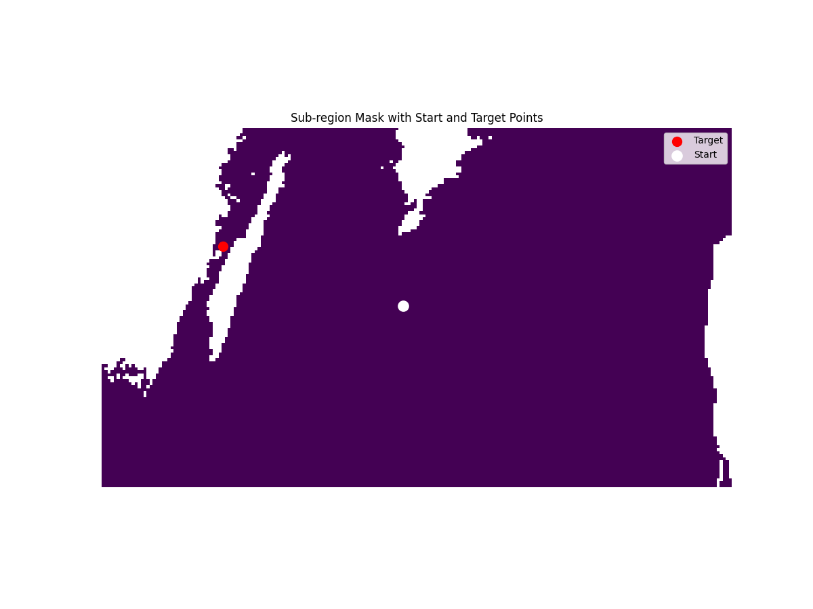
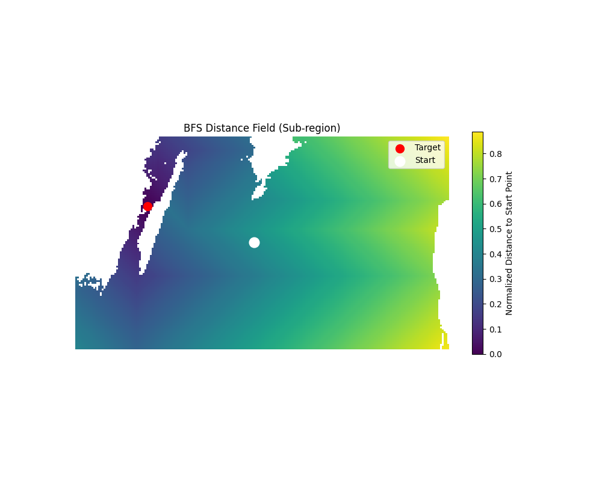

# BFS-Based Distance Field for Maritime Navigation

This tool computes and visualizes a BFS (Breadth-First Search) distance field on a land-sea binary mask. It extracts a sub-region, computes navigable distances from a start point, crops a local patch around a target location, and exports results as PyTorch tensors — ideal for robotics, path planning, or learning-based navigation.

## 🔍 Features

- Load global land-sea mask (`.npy` format: `0 = sea`, `1 = land`)
- Extract user-defined sub-region (e.g., 120×210)
- Compute normalized BFS distance field from a sea point
- Crop a local sub-sub region (e.g., 12×21) centered at a target point
- Output two PyTorch tensors:
  - `D_G`: full sub-region distance field → `(120, 210)`
  - `D_L`: local distance patch → `(≤12, ≤21)`
- Generate 4 clear visualizations

## 🖼️ Visualizations

1. **Global land-sea mask** with sub-region highlighted  
   

2. **Sub-region mask** with start (● red) and target (✕ blue) points  
   

3. **BFS distance field** (normalized by 300)  
   

4. **Sub-sub region crop** centered at target  
   

> 💡 *After running the script, save the four figures as `fig1_global_mask.png`, `fig2_subregion.png`, `fig3_distance_field.png`, and `fig4_subsub_region.png` in an `assets/` folder to display them.*

## ⚙️ Usage

### Requirements
```bash
pip install numpy matplotlib torch
