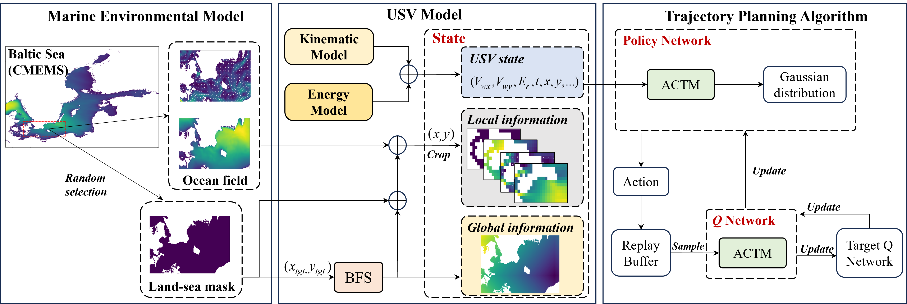
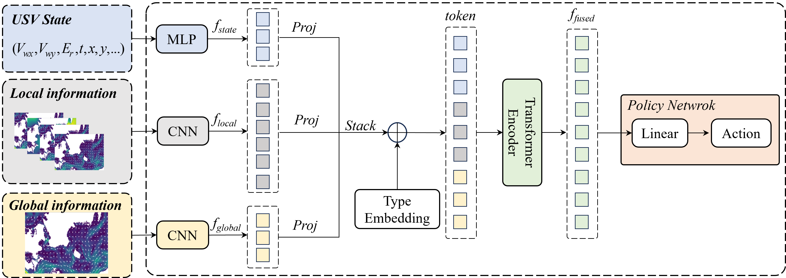
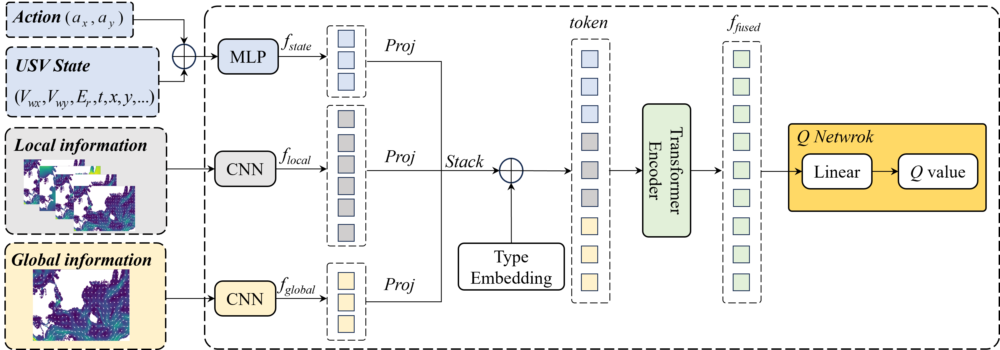

# Adaptive Fusion of Multi-Source Information for USV Trajectory Planning via Deep Reinforcement Learning

This repository provides resources related to **ATCM-SAC**. It also includes information about the **CMEMS Dataset**, which serves as the foundational dataset for training and evaluation.

---


## 🌤️ ATCM-SAC

### Description
The ATCM-SAC framework consists of three parts, including the marine environment model, the USV model and the trajectory planning model.
### Figures


ATCM (Adaptive Trajectory Control Module) is designed based on the transformer architecture for advanced feature extraction and adaptive fusion, which enables the agent to dynamically adjust the weight of attention and the allocation of information sources in different scenarios.
### Figures



### Resources
- [Baidu Netdisk](https://pan.baidu.com/s/1U2R1KrnvInvzAtw29cwB5A) - Download the visual animated **GIF**： *(Extraction Code: iitx)*  
---

## 📊 CMEMS Dataset

### Description
The **CMEMS Dataset** from the Copernicus Marine Environment Monitoring Service provides global historical ocean data at high spatial and temporal resolution. It provides data related to ocean currents and waves, serving as the backbone for training the RL model.

### Resources
- [Official Website](https://data.marine.copernicus.eu/product/GLOBAL_ANALYSISFORECAST_WAV_001_027/description)

---

## 📄 License

### CMEMS Dataset
The use of this dataset is distributed under the **Service Commitments and Licence**. Commercial use of these models is strictly prohibited.

For more details, please refer to the [license terms](https://marine.copernicus.eu/user-corner/service-commitments-and-licence).

### ATCM-SAC & Custom Models
Unless otherwise stated, all custom models and tools provided in this repository are released under the **MIT License** for non-commercial research purposes.

---

## 📚 Citation

If you use any of the models or datasets in your research, please cite the following works:

### CMEMS Dataset:
```bibtex
@dataset{data,
  author = {{Baltic Sea Physical Model Product}},
  title = {Baltic Sea Physical Model Forecast Dataset},
  publisher = {Copernicus Marine Service},
  year = {2023},
  doi = {10.48670/moi-00010},
  url = {https://doi.org/10.48670/moi-00010} 
}
